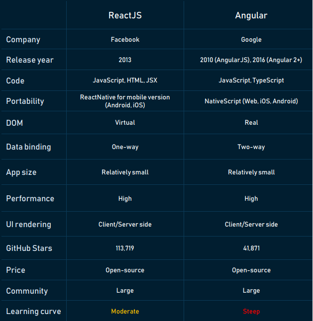
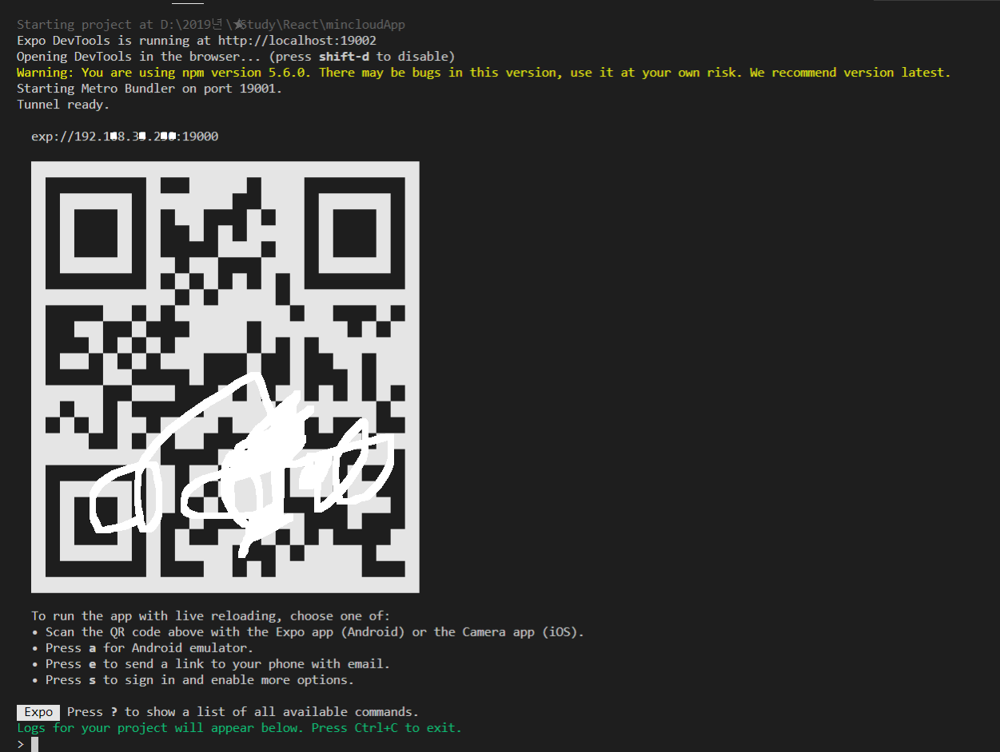
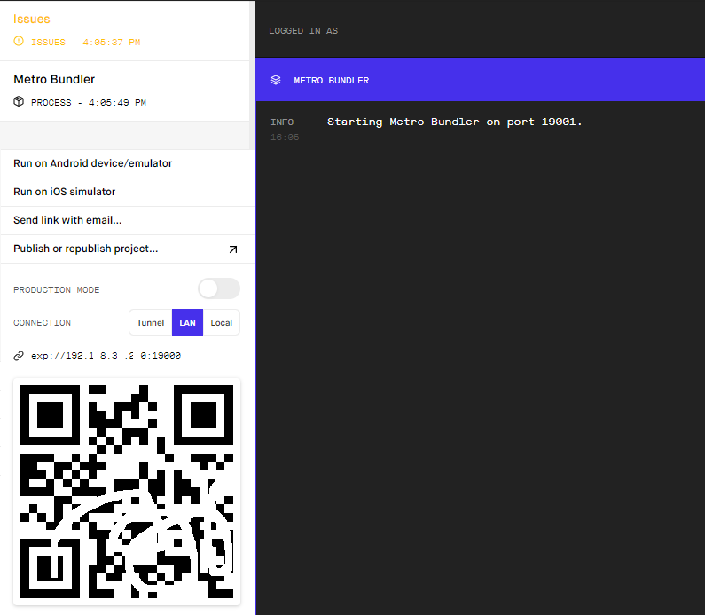

# React [](https://www.reactjs.org/docs/hello-world.html)

React Study Project

### Angular vs. React

- Angular는 Google에서 만들고 관리하는 Front-End `Framework`이며, 대부분의 코드 편집기에서 작성 가능하다.
- Angular는 MEAN 스택의 구성원이며 무료 오픈 소스 Tool Set이다.
- MEAN Stack은 `M`ongoDB (NoSQL DB), `E`xpress.js (Back-End Framework), `A`ngular 또는 AngularJS (Front-End Framework) 및 `N`ode.js (Server Platform)로 구성
- Angular Framework는 개발자들이 동적 단일 페이지 웹 애플리케이션(SPA)을 만들 수 있게 해준다.
- Angular가 처음 출시되었을 때 가장 주요한 장점은 HTML 기반 문서를 동적인 콘텐츠로 변환 가능하다.

- React.js는 동적 사용자 인터페이스를 만들기 위해 Facebook에서 2011년에 만든 오픈 소스 JavaScript `Library`
- React는 Front-End 개발을 위한 HTML 요소의 생성을 허용하는 JavaScript 및 JSX를 기반으로 한다.
- React에는 모바일 앱 개발을 위한 별도의 Cross-Platform Framework인 React Native가 있다.



### React 통합 및 지원 도구

- `Redux` : 상태를 관리하는 Container로 React로 대규모 응용프로그램을 작성할 때 효과적으로 많은 동적 요소가 있는 응용 프로그램의 구성 요소를 관리하며 렌더링에도 사용되며, Redux용 선택기 라이브러리 및 Redux DevTools Profiler Monitor를 포함하는 더 넓은 Redux ToolSet와 함께 작동한다.
- `Babel` : JSX를 application이 JavaScript로 변환을 시킴으로써 browser에서 이해할 수 있도록 해주는 Trans-Compiler
- `Webpack` : 모든 구성 요소가 서로 다른 파일로 작성되므로 더 나은 관리를 위해 구성 요소를 Bundle로 만들어 준다.
- `React Router` : React와 함께 일반적으로 사용되는 표준 URL Routing Library

- Angular와 달리 React에서는 단일 Tool로 전체 앱을 테스트 할 수 없으며, 각기 다른 테스트 유형마다 별도의 Tool을 사용해야 한다.
	- Enzyme /  Unexpected-react : 컴포넌트 테스팅
	- Jest :  자바스크립트 코드
	- react-testing-library : React DOM 테스팅
	- React-unit :  unit 테스팅
	- Skin-deep : Rendering Test utils

#### JSX (Javascript XML)

- JavaScript를 확장한 문법으로 UI가 어떻게 생겨야 하는지 설명하기 위해 React와 함께 사용 권장된다.
- JSX는 React `element` 를 생성한다.
- React에서는 이벤트가 처리되는 방식, 시간에 따라 state가 변하는 방식, 화면에 표시하기 위해 데이터가 준비되는 방식 등 rendering logic이 다른 UI logic과 연결된다.
- React는 별도의 파일에 markup과 logic을 넣어 기술을 인위적으로 분리하는 대신, 둘 다 포함하는 `component`라는 느슨하게 연결된 unit으로 관심사를 분리한다.

```js
function formatName(user) {
  return user.firstName + ' ' + user.lastName;
}

// JSX를 if 구문 및 for loop 안에 사용하고, 변수에 할당하고, 인자로서 받아들이고, 함수로부터 반환 가능하다.
function getGreeting(user) {
  if (user) {
    return <h1>Hello, {formatName(user)}!</h1>;
  }
  return <h1>Hello, Stranger.</h1>;
}

const user = {
  firstName: 'J.Ho',
  lastName: 'Moon'
};

const element = ( // 괄호 안에는 유효한 모든 JavaScript 표현식을 넣을 수 있다.
  <h1>
    Hello, {formatName(user)}!  // JavaScript 함수 호출의 결과를 element에 포함한다.
  </h1>
);

ReactDOM.render(
  element,
  document.getElementById('root')
);
```

#### Element Rendering (index.js)

- element는 React app의 가장 작은 단위로 화면에 표시할 내용을 기술한다.
- element는 component의 구성 요소이다.

```java
// 이 안에 들어가는 모든 element를 React DOM에서 관리하기 때문에 root DOM Node라 한다.
<div id="root"></div>

// React element를 root DOM node에 rendering하려면 둘 다 ReactDOM.render()로 전달하면 된다.
const element = <h1>Hello, world</h1>;
ReactDOM.render(element, document.getElementById('root'));
```

- React element는 불변객체로 생성한 이후에는 해당 element의 자식이나 속성을 변경할 수 없다. UI를 update하는 유일한 방법은 새로운 element를 생성하고 이를 ReactDOM.render()로 전달하는 것이다.
- React DOM은 해당 element와 그 자식 element를 이전의 element와 비교하고, DOM을 원하는 상태로 만드는데 필요한 경우에만 DOM을 update한다.

```java
function tick() {
  const element = (
    <div>
      <h1>Hello, world!</h1>
      <h2>It is {new Date().toLocaleTimeString()}.</h2>
    </div>
  );
  // 매초 전체 UI를 다시 그리도록 element를 만들었지만, React DOM은 내용이 변경된 text node만 update한다.
  ReactDOM.render(element, document.getElementById('root'));
}

setInterval(tick, 1000);
```

### Components & Props (App.js)

- component를 통해 UI를 재사용 가능한 개별적인 여러 조각으로 나누고, 각 조각을 개별적으로 살펴볼 수 있다.
- `props`라고 하는 임의의 input을 받은 후, 화면에 어떻게 표시되는지를 기술하는 React element를 반환한다.

```java
// ECMAScript6 class를 사용하여 컴포넌트를 정의
class Welcome extends React.Component {
  render() {
    return <h1>Hello, {this.props.name}</h1>;
  }
}

const element = <Welcome name="Sara" />;
ReactDOM.render(
  element,
  document.getElementById('root')
);
```
#### Run

```bash
$ npm install -g create-react-app # 프로젝트 생성 명령 설치하기, -g 옵션은 시스템 공통 폴더에 설치하라는 옵션
$ create-react-app mincloud # 프로젝트 생성하기
$ cd mincloud # 생성한 프로젝트 폴더에 들어가기
$ npm start # 프로젝트 실행하기, node.js에서 해당 프로젝트가 실행된다. (App.js)

> mincloud@0.1.0 start D:\React\mincloud
> react-scripts start

Compiled successfully!

You can now view mincloud in the browser.

  http://localhost:3000/

Note that the development build is not optimized.
To create a production build, use npm run build.
```

---

### State & Lifecycle, Event 처리 (Clock.js, Toggle.js)

- State를 이용하여 component를 완전히 재사용하고 캡슐화하는 방법 (index.js)
- 모든 state는 항상 특정한 component가 소유하고 있으며, 그 state로부터 파생된 UI 또는 data는 오직 tree 구조에서 자신의 `아래`에 있는 component에만 영향을 미친다.
- DOM element가 생성된 후, listener를 추가하기 위해 addEventListener를 호출할 필요가 없는 대신, element가 처음 rendering될 때 listener를 제공하면 된다.

```js
import React from 'react';
import ReactDOM from 'react-dom';
import './index.css';
//import App from './App';
import Clock from './Clock'; // <== Clock component를 import한다.
import * as serviceWorker from './serviceWorker';

ReactDOM.render(<Clock />, document.getElementById('root'));

serviceWorker.unregister();
```

```js
handleClick() { // event handler를 class의 method로 만든다.
    this.setState(state => ({
      isToggleOn: !state.isToggleOn
    }));
  }

render() {
	return (
	  <button onClick={this.handleClick}> // JSX를 사용하여 문자열이 아닌 함수로 이벤트 핸들러를 전달한다.
	    {this.state.isToggleOn ? 'ON' : 'OFF'}
	  </button>
	);
}
```

```bash
$ npm start # 프로젝트 실행하기, node.js에서 해당 프로젝트가 실행된다. (Clock.js)
```

### 조건부 Rendering (LoginControl.js / Page.js)

- React에서는 원하는 동작을 캡슐화하는 component를 만들 수 있는데 application의 state에 따라서 component 중 몇 개만을 rendering할 수 있다.
- element를 저장하기 위해 변수를 사용하여 출력의 다른 부분은 변하지 않은 채로 component의 일부를 조건부로 rendering할 수 있다.

```js
render() {
  const isLoggedIn = this.state.isLoggedIn;
  let button;

  // 변수를 선언하고 if를 사용해서 조건부로 렌더링 처리
  if (isLoggedIn) {
    button = <LogoutButton onClick={this.handleLogoutClick} />;
  } else {
    button = <LoginButton onClick={this.handleLoginClick} />;
  }

  return (
    <div>
      <Greeting isLoggedIn={isLoggedIn} />
      {button}
    </div>
  );
}
```

- rendering 결과를 출력하는 대신 null을 반환하여, 다른 component에 의해 rendering될 때 component 자체를 숨길 수 있다.

```js
if (!props.warn) {
  return null;
}
```

### List & Key (Blog.js)

- element 모음을 만들고 중괄호 {}를 이용하여 JSX에 포함 시킬 수 있다.
- 일반적으로 component 안에서 list를 rendering 한다.
- Key는 React가 어떤 항목을 변경/추가/삭제할지 식별하는 것을 돕는데 element에 안정적인 고유성을 부여하기 위해 배열 내부의 element에 지정해야 한다.
- map() 함수 내부에 있는 element에 key를 넣어 주는 게 좋다.
- map() 함수가 너무 중첩된다면 component로 추출 하는 것이 좋다.

```js
const content = props.posts.map((post) =>
  <div key={post.id}>
    <h3>{post.title}</h3>
    <p>{post.content}</p>
  </div>
);
```

### Form (NameForm.js, EssayForm.js, FlavorForm.js, Reservation.js)

- HTML Form element는 자체가 내부 상태를 가지기 때문에, React의 다른 DOM element와 조금 다르게 동작한다. 순수한 HTML에서 이 Form은 name을 입력 받는다.
- React에 의해 값이 제어되는 입력 form element를 `controlled component`라고 한다.
- select tag에 multiple option을 허용한다면 value attribute에 배열을 전달할 수 있다. `<select multiple={true} value={['B', 'C']}>`

```js
<form onSubmit={this.handleSubmit}>
    <label>
      Name:
      <input type="text" value={this.state.value} onChange={this.handleChange} />
      <textarea value={this.state.value} onChange={this.handleChange} />
	  <select value={this.state.value} onChange={this.handleChange}>
    </label>
    <input type="submit" value="Submit" />
</form>	  
```

### State 끌어올리기 (Calculator.js)

- 종종 동일한 데이터에 대한 변경사항을 여러 컴포넌트에 반영해야 할 필요가 있을 때, 가장 가까운 공통 조상으로 state를 끌어올리는 것이 좋다.
- React에서 state를 공유하는 일은 그 값을 필요로 하는 component 간의 가장 가까운 공통 조상으로 state를 끌어올림으로써 이뤄낼 수 있다.
- 지역 state를 지우고 props가 같은 부모 class로 state를 끌어올림으로써 동기화된 상태를 유지할 수 있다.

```js
render() {
	// Before: const temperature = this.state.temperature;
	const temperature = this.props.temperature;
	// ...

handleChange(e) {
    // Before: this.setState({temperature: e.target.value});
    this.props.onTemperatureChange(e.target.value);
    // ...
```

### Composition vs. Inheritance (SignUpDialog.js)

- React는 강력한 합성 모델을 가지고 있으며, 상속 대신 합성을 사용하여 component 간에 code를 재사용하는 것이 좋다.
- 다른 component에서 JSX를 중첩하여 임의의 자식을 전달할 수 있다.
- 더 `구체적인` component가 `일반적인` component를 rendering하고 props를 통해 내용을 구성할 수 있다.
- 합성은 class로 정의된 component에서도 동일하게 적용된다.

```js
function Dialog(props) {
    return (
      <FancyBorder color="blue"> // Dialog에 FancyBorder를 합성
// ...

class SignUpDialog extends React.Component {
// ...
render() {
  return (
    <Dialog title="Mars Exploration Program" // SignUpDialog에 Dialog를 합성
// ...
    </Dialog>
  );
}
```

- Facebook에서는 수천 개의 React component를 사용하지만, component를 상속 계층 구조로 작성을 권장할만한 사례가 아직 없다.
- props와 합성은 명시적이고 안전한 방법으로 component의 모양과 동작을 customizing하는데 필요한 모든 유연성을 제공한다.
- UI가 아닌 기능을 여러 component에서 재사용하기를 원한다면, 별도의 JavaScript module로 분리하는 것이 좋다. 상속받을 필요 없이 component에서 해당 함수, 객체, 클래스 등을 import 하여 사용할 수 있다.

---

### React를 활용한 설계 (FilterableProductTable.js)

- React는 JavaScript로 규모가 크고 빠른 Web Application을 만드는 가장 좋은 방법이다. React는 Facebook과 Instagram을 통해 확장성을 입증했다.

#### 1단계: UI를 Component 계층 구조로 나누기

- 모든 컴포넌트(와 하위 컴포넌트)의 주변에 박스를 그리고 그 각각에 naming하기 (디자이너의 Photoshop layer name이 React component name이 될 수 있다.)
- 단일 책임 원칙 (single responsibility principle)에 따라 component를 분리한다.


- FilterableProductTable(노란색): 예시 전체를 포괄한다.
- SearchBar(파란색): 모든 유저의 입력(user input)을 받는다.
- ProductTable(연두색): 유저의 입력(user input)을 기반으로 데이터 콜렉션(data collection)을 필터링 해서 보여준다.
- ProductCategoryRow(하늘색): 각 카테고리(category)의 헤더를 보여준다.
- ProductRow(빨강색): 각각의 제품(product)에 해당하는 행을 보여준다.

[Component 계층 구조]

- FilterableProductTable
	- SearchBar
	- ProductTable
		- ProductCategoryRow
		- ProductRow


#### 2단계: React로 정적인 버전 만들기

- data model을 rendering하는 app의 정적 버전을 만들기 위해 다른 component를 재사용하는 component를 만들고 props를 이용해 data를 전달한다.
- props는 부모가 자식에게 data를 넘겨줄 때 사용할 수 있는 방법으로 정적 버전을 만들기 위해 state를 사용하지 않아야 한다.
- state는 오직 상호작용을 위해, 즉 시간이 지남에 따라 data가 바뀌는 것에 사용한다.
- app을 만들 때 하향식(top-down)이나 상향식(bottom-up)으로 만들 수 있으나, project가 커지면 상향식으로 만들고 test를 하면서 개발하기가 더 쉽다.
- React의 단방향 데이터 흐름(one-way data flow) (or 단방향 바인딩(one-way binding))는 모든 것을 모듈화 하고 빠르게 만들어 준다.

#### 3단계: UI state에 대한 최소한의 (하지만 완전한) 표현 찾아내기

- UI를 상호작용하게 만들려면 기반 데이터 모델을 변경할 수 있는 방법이 있어야 하는데 state를 통해 변경한다.
- application이 필요로 하는 가장 최소한의 state를 찾고, 이를 통해 나머지 모든 것들이 필요에 따라 계산되도록 만든다. (중복배제 원칙)
- state 판단 기준
	- 부모로부터 props를 통해 전달되는가? 그러면 확실히 state가 아니다.
	- 시간이 지나도 변하지 않는가? 그러면 확실히 state가 아니다.
	- component 안의 다른 state나 props를 가지고 계산 가능한가? 그러면 state가 아니다.

#### 4단계: State가 어디에 있어야 할 지 찾기

- 최소한으로 필요한 state가 뭔지 찾은 후 어떤 component가 state를 변경하거나 소유할지 찾아야 한다.
	- state를 기반으로 rendering하는 모든 component를 찾는다.
	- 공통 소유 component를 찾는다. (계층 구조 내에서 특정 state가 있어야 하는 모든 component들의 상위에 있는 하나의 component)
	- 공통 또는 더 상위에 있는 component가 state를 가져야 한다.

- state를 소유할 적절한 component를 찾지 못하면, state를 소유하는 component를 하나 만들어서 공통 owner component의 상위 계층에 추가한다.

#### 5단계: 역방향 데이터 흐름 추가하기

- 계층 구조 아래로 흐르는 props와 state의 함수로써 app을 만든 후, 계층 구조의 하단에 있는 form component에서 FilterableProductTable의 state를 update할 수 있어야 한다.
- React는 전통적인 양방향 데이터 바인딩(two-way data binding)과 비교하면 더 많은 typing을 필요로 하지만 데이터 흐름을 명시적으로 보이게 만들어서 program이 어떻게 동작하는지 파악할 수 있게 도와준다.
- FilterableProductTable는 SearchBar에 callback을 넘겨서 state가 update되어야 할 때마다 호출되도록 한다.

```java
// ...
handleFilterTextChange(filterText) {
  this.setState({
    filterText: filterText
  });
}
    
handleInStockChange(inStockOnly) {
  this.setState({
    inStockOnly: inStockOnly
  })
} // ...
```

---

### More...

- 대부분 React app들은 Webpack, Rollup 또는 Browserify 같은 tool을 사용하여 여러 파일을 하나로 병합한 `bundle` file을 webpage에 포함하여 한 번에 전체 app을 load 할 수 있다. [](https://github.com/webpack/webpack/releases)

```bash
$ npm install --save-dev webpack
```

- 동적 import() 문법을 사용한 코드 분할은 거대하게 bundle된 app의 `지연 로딩`하게 도와주고 성능을 향상시킨다. app의 code 양을 줄이지 않고도 사용자가 필요하지 않은 code를 불러오지 않게 하며 app의 초기화 loading을 줄여준다. (but 아직 ECMAScript의 표준 문법이 아니라 제안 단계)

```js
// Before
import { add } from './math';
console.log(add(16, 26));

// After
import("./math").then(math => {
  console.log(math.add(16, 26));
});
```

- React.lazy 함수를 사용하면 동적 import를 사용해서 component를 rendering 할 수 있다.

```js
import MyErrorBoundary from './MyErrorBoundary';

// Before
import OtherComponent from './OtherComponent';

// After
const OtherComponent = React.lazy(() => import('./OtherComponent'));
const AnotherComponent = React.lazy(() => import('./AnotherComponent'));

function MyComponent() {
  return (
    <div>
      // Error Boundary를 만들고 lazy component를 감싸면 network 장애가 발생했을 때 error를 표시할 수 있다.
      <MyErrorBoundary>
      // Suspense는 lazy component가 laod되길 기다리는 동안 loading 화면과 같은 예비 contents를 보여줄 수 있게 한다.
      // fallback prop은 component가 laod될 때까지 기다리는 동안 rendering하려는 React element를 받아들인다.
      <Suspense fallback={<div>Loading...</div>}>        
        <section>
          <OtherComponent />
          <AnotherComponent />
        </section>
      </Suspense>
     </MyErrorBoundary>
    </div>
  );
}
```

- React.lazy를 React Router library를 사용해서 application에 route 기반 code 분할을 설정할 수 있다.

```js
import { BrowserRouter as Router, Route, Switch } from 'react-router-dom';
import React, { Suspense, lazy } from 'react';

const Home = lazy(() => import('./routes/Home'));
const About = lazy(() => import('./routes/About'));

const App = () => (
  <Router>
    <Suspense fallback={<div>Loading...</div>}>
      <Switch>
        <Route exact path="/" component={Home}/>
        <Route path="/about" component={About}/>
      </Switch>
    </Suspense>
  </Router>
);
```

---

### React Native [](https://facebook.github.io/react-native/)


- React Native는 Facebook이 공개한 iOS와 Android App 개발을 위한 Library
- Hot ReLoading 기능으로 Code 수정 사항에 대해 build를 하지 않아도 UI상에서 즉시 확인 가능하여 개발 생산성이 비약적으로 높음


- React Native는 iOS version의 facebook group, android version의 Facebook Ads Manager, iOS version 등의 facebook app에서 사용 중

#### Pre-requisite

- Expo는 universal React applications를 위한 framework and platform이다.
- 기존 Expo XDE에서 dev tool(=expo cli 최신버전) 설치 권장
- Install Expo. (on NodeJS 환경) [](https://docs.expo.io/versions/v35.0.0/get-started/installation/)

```bash
$ npm install -g expo-cli
$ expo init [new project]

	? Choose a template:
	  ----- Managed workflow -----
	> blank                 a minimal app as clean as an empty canvas
	  blank (TypeScript)    same as blank but with TypeScript configuration
	  tabs                  several example screens and tabs using react-navigation
	  ----- Bare workflow -----
	  minimal               bare and minimal, just the essentials to get you started
	  minimal (TypeScript)  same as minimal but with TypeScript configuration

	? Choose a template: expo-template-tabs
	√ Please enter a few initial configuration values.
	  Read more: https://docs.expo.io/versions/latest/workflow/configuration/ · 100% completed

$ cd [new project]
$ npm start
```



- Expo Client라는 App을 통해서 자신의 모바일 기기에서 바로 구동시켜 테스트가 가능하다. 단, 개발PC와 모바일 기기가 같은 네트워크를 사용해야 한다.
- https://expo.io/ 에 계정을 생성해야 한다.
- QR Code를 스캔하여 본인 스마트폰에서 실행
- `expo app`에서 실행 중일 때 폰을 흔들어주면, dev mode로 들어간다.
- http://localhost:19002 에서 Simulating이 가능하다. (Shift+d로 disable 가능하다.)



#### Home Screen 생성

- `MainTabNavigator.js`에서 Home.js로 교체

```js
import HomeScreen from '../screens/Home'; // Default를 교체
```

- `Home.js` Contents 작성

```java
import React from 'react';
import { StyleSheet, Text, View, Button } from 'react-native'; // Button 추가

export default class Home extends React.Component {
  render() {
    return (
      <View style={styles.container}>
        <Button title="Column Layout" onPress={() => {
                this.props.navigation.navigate('Column');}}
        />
        <Button title="Row Layout" onPress={() => {
                this.props.navigation.navigate('Row');}}
        />
        <Button title="Absolute Layout" onPress={() => {
                this.props.navigation.navigate('Absolute');}}
        />
      </View>
    );
  }
}
```

- Flex Layout의 Direction Test (아래 파일 확인)

```bash
components/Column.js
components/Row.js
components/Absolute.js
```